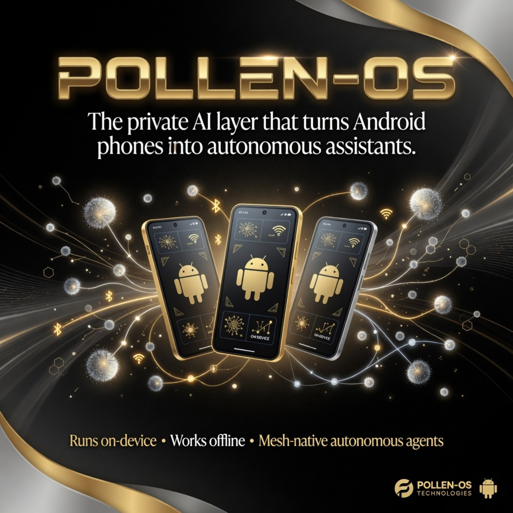

🌼 POLLEN-OS

**Offline-first mesh coordination for Android devices.**

POLLEN-OS is an experimental Android alpha that turns nearby phones into local mesh nodes capable of discovering peers, exchanging task packets, recording results, and using an onboard AI-style decision layer to assess mesh health.

The goal is simple:

> Ordinary phones should be able to coordinate locally when cloud, Wi-Fi, or cellular infrastructure is unavailable.

POLLEN-OS is currently in active alpha development.

---

## What is POLLEN-OS

POLLEN-OS is a mobile mesh coordination layer for Android.

It is designed for field testing, resilience research, offline coordination experiments, and future use cases such as:

- search and rescue coordination
- underground / low-connectivity teams
- disaster response testing
- rural/off-grid communication experiments
- industrial field teams
- local device-to-device task routing
- AI-assisted mesh health monitoring

This is **not** an emergency replacement system yet. It is an alpha research prototype focused on proving the core primitives.

---

## Current Alpha Capabilities

Current alpha builds include:

- Android peer discovery
- nearby mesh status tracking
- task packet creation
- task result history
- ACK-style result handling
- latency recording
- debug/event logging
- tester log export
- AI mesh health scoring
- AI recommended action state
- field/range probe testing tools
- basic task compatibility fallback
- sensitive task blocking for untrusted peers
- polished alpha dashboard UI

---

## Core Primitive

The main primitive POLLEN-OS is proving:

```text
Phone A detects Phone B
Phone A creates a task packet
Phone A sends the task through the local mesh
Phone B receives the task
Phone B executes/responds
Phone A receives ACK/result
Phone A records latency, status, and result
AI layer evaluates mesh health
